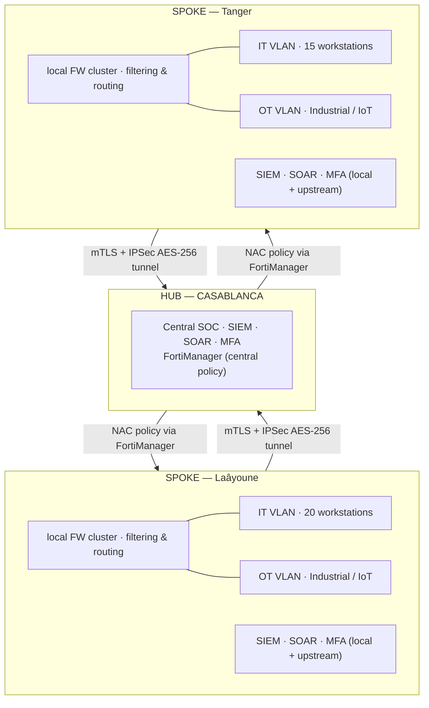
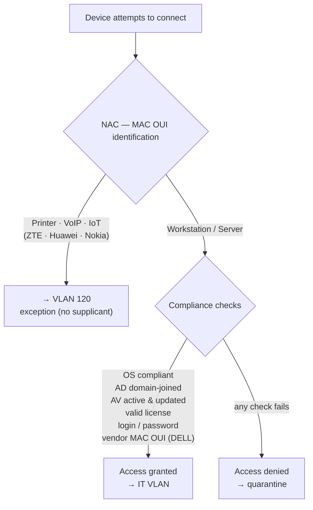

# Secure Network Architecture — Multi-site (Hub & Spoke)

Design of a **multi-site enterprise security architecture** applying
**defense in depth** and **Zero Trust** principles: layered segmentation, strict
IT / OT separation, end-to-end encryption (mTLS + IPSec), and centralized
supervision by a SOC (SIEM / SOAR).

**Hub-and-spoke** topology: a headquarters (Casablanca) and two remote sites
(Laâyoune, Tanger) connected by encrypted tunnels.

> Design project for my cybersecurity coursework. The editable source is
> included: [`architecture_reseau.drawio`](architecture_reseau.drawio)
> (open at [app.diagrams.net](https://app.diagrams.net)).

---

## Layered overview

Traffic enters through the **Cloud EDGE** (SASE + DDoS protection) then crosses
four security layers, each with its own role. Baseline at every boundary:
**default deny + mTLS**.

Key security point: the `internal` OT flow is protected by a **data diode** that
makes the path **physically one-way** — the industrial world can be observed but
never reached from IT.

---

## Multi-site topology

Remote sites (spokes) replicate a local security stack (FW, SIEM, SOAR, MFA,
IT/OT VLAN separation) and report to the hub over **mTLS + IPSec AES-256**
tunnels. Policy is pushed from the hub via **FortiManager**.

---

## Network Access Control (NAC) policy

On connection, each device is identified by its **MAC OUI** (first 6 bytes =
vendor). Devices with no supplicant (printers, VoIP, IoT) go to a dedicated VLAN;
workstations and servers undergo full compliance checks before being granted
access.

---

## Design decisions & rationale

| Decision | Why |
|----------|-----|
| **Defense in depth (4 layers)** | One barrier isn't enough; each layer limits propagation if the previous one falls. |
| **Default deny + mTLS everywhere** | Nothing is allowed by default; mutual auth prevents service impersonation. |
| **IT / OT separation + Data Diode** | Industrial systems (SCADA/PLC) must never be reachable from IT; the diode makes the flow **physically** one-way. |
| **Encrypted hub & spoke (IPSec AES-256)** | Centralizes policy and monitoring while keeping local autonomy per site. |
| **Global SOC (SIEM + SOAR)** | Correlates logs across all sites/layers + automated playbook response. |
| **NAC with OUI exceptions** | Realistic access control: you can't require a supplicant from a printer, hence the exception VLAN. |
| **East-West micro-segmentation** | Blocks lateral movement of an attacker already inside. |

---

## Technologies by domain

| Domain | Solutions |
|--------|-----------|
| Edge / SASE | Prisma SASE, Cloudflare (DDoS) |
| Firewall / SD-WAN | FortiGate 6000F, FortiManager, FortiAnalyzer |
| Application security | WAF (OWASP Top 10), EDR, Akamai API Gateway |
| Secrets / PAM | HashiCorp Vault, CyberArk |
| Network access | NAC, micro-segmentation, IT/OT VLANs, ACLs |
| Endpoints | UEM (patching, inventory), EDR |
| OT / Industrial | Industrial FW (Modbus, OPC-UA), Data Diode, OT visibility |
| SOC | SIEM, SOAR, MFA (Entra ID Protect) |
| Encryption | mTLS, IPSec AES-256 |

---

## Source file

The full original diagram (with graphical layout and color legend) is editable
at [`architecture_reseau.drawio`](architecture_reseau.drawio). To export it as an
image into `docs/`: open at [app.diagrams.net](https://app.diagrams.net) →
*File → Export as → PNG*.
