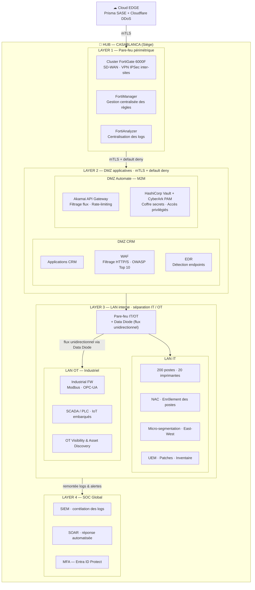
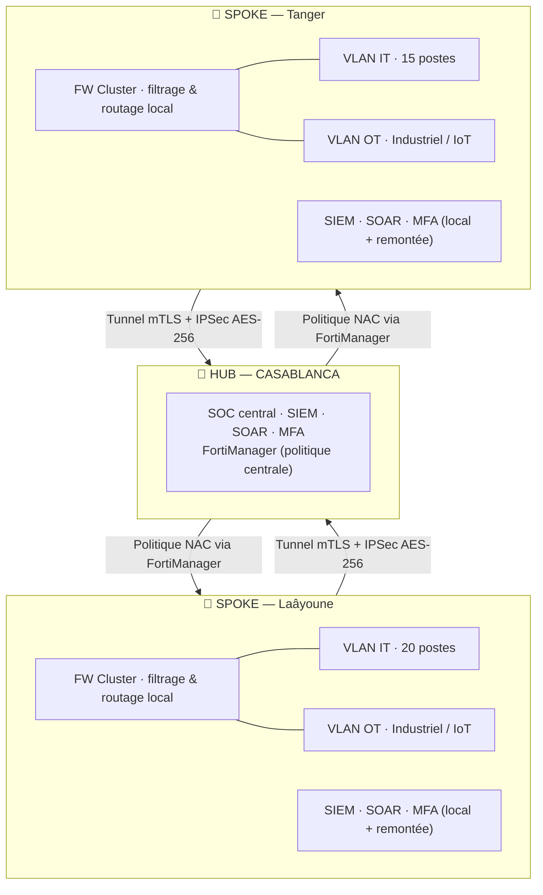
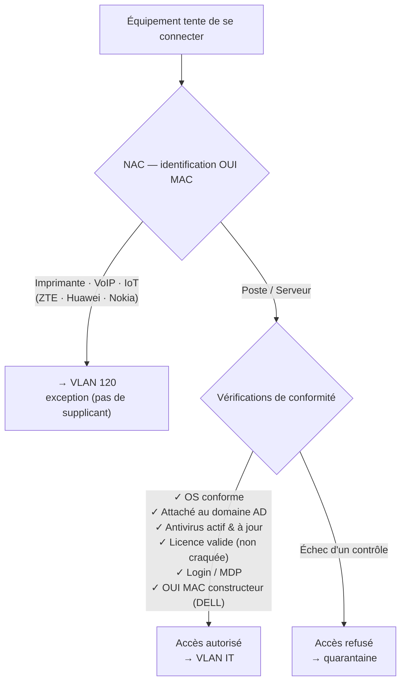

# Architecture Réseau Sécurisée — Multi-sites (Hub & Spoke)

Conception d'une **architecture de sécurité d'entreprise multi-sites** appliquant
la **défense en profondeur** et les principes **Zero Trust** : segmentation en
couches, séparation stricte IT / OT, chiffrement de bout en bout (mTLS + IPSec),
et supervision centralisée par un SOC (SIEM / SOAR).

Topologie **hub-and-spoke** : un siège (Casablanca) et deux sites distants
(Laâyoune, Tanger) reliés par tunnels chiffrés.

> Projet de conception réalisé dans le cadre de ma formation en cybersécurité.
> Le fichier source éditable est fourni : [`architecture_reseau.drawio`](architecture_reseau.drawio)
> (ouvrir sur [app.diagrams.net](https://app.diagrams.net)).

---

## Sommaire

- [Vue d'ensemble en couches](#vue-densemble-en-couches)
- [Topologie multi-sites](#topologie-multi-sites)
- [Politique de contrôle d'accès (NAC)](#politique-de-contrôle-daccès-nac)
- [Choix de conception & justifications](#choix-de-conception--justifications)
- [Technologies par domaine](#technologies-par-domaine)

---

## Vue d'ensemble en couches

Le trafic entre par le **Cloud EDGE** (SASE + protection DDoS) puis traverse
quatre couches de sécurité, chacune avec sa fonction. Principe de base à chaque
frontière : **default deny + mTLS**.

---

## Topologie multi-sites

Les sites distants (spokes) répliquent une pile de sécurité locale (FW, SIEM,
SOAR, MFA, séparation VLAN IT/OT) et remontent vers le hub via des tunnels
**mTLS + IPSec AES-256**. La politique de sécurité est poussée depuis le hub via
**FortiManager**.

---

## Politique de contrôle d'accès (NAC)

À la connexion, chaque équipement est identifié par son **OUI MAC** (les 6
premiers octets = fabricant). Les équipements sans supplicant (imprimantes,
VoIP, IoT) partent en VLAN dédié ; les postes et serveurs subissent une
vérification complète de conformité avant d'obtenir un accès.

---

## Choix de conception & justifications

| Décision | Pourquoi |
|----------|----------|
| **Défense en profondeur (4 couches)** | Une seule barrière ne suffit pas ; chaque couche limite la propagation si la précédente tombe. |
| **Default deny + mTLS partout** | Rien n'est autorisé par défaut ; l'authentification mutuelle empêche l'usurpation de service. |
| **Séparation IT / OT + Data Diode** | Le monde industriel (SCADA/PLC) ne doit jamais être atteignable depuis l'IT ; le data diode rend le flux **physiquement** unidirectionnel. |
| **Hub & Spoke chiffré (IPSec AES-256)** | Centralise la politique et la supervision tout en gardant une autonomie locale sur chaque site. |
| **SOC global (SIEM + SOAR)** | Corrélation des logs de tous les sites/couches + réponse automatisée par playbooks. |
| **NAC avec exceptions OUI** | Contrôle d'accès réaliste : on ne peut pas exiger un supplicant d'une imprimante, d'où le VLAN d'exception. |
| **Micro-segmentation East-West** | Bloque les déplacements latéraux d'un attaquant déjà entré. |

---

## Technologies par domaine

| Domaine | Solutions |
|---------|-----------|
| **Edge / SASE** | Prisma SASE, Cloudflare (DDoS) |
| **Pare-feu / SD-WAN** | FortiGate 6000F, FortiManager, FortiAnalyzer |
| **Sécurité applicative** | WAF (OWASP Top 10), EDR, Akamai API Gateway |
| **Secrets / PAM** | HashiCorp Vault, CyberArk |
| **Accès réseau** | NAC, micro-segmentation, VLAN IT/OT, ACL |
| **Endpoints** | UEM (patches, inventaire), EDR |
| **OT / Industriel** | Industrial FW (Modbus, OPC-UA), Data Diode, OT visibility |
| **SOC** | SIEM, SOAR, MFA (Entra ID Protect) |
| **Chiffrement** | mTLS, IPSec AES-256 |

---

## Fichier source

Le diagramme complet original (avec la mise en page graphique et la légende
couleur) est éditable ici : [`architecture_reseau.drawio`](architecture_reseau.drawio).
Pour l'exporter en image et l'ajouter dans `docs/` :
ouvrir sur [app.diagrams.net](https://app.diagrams.net) → *File → Export as → PNG*.
